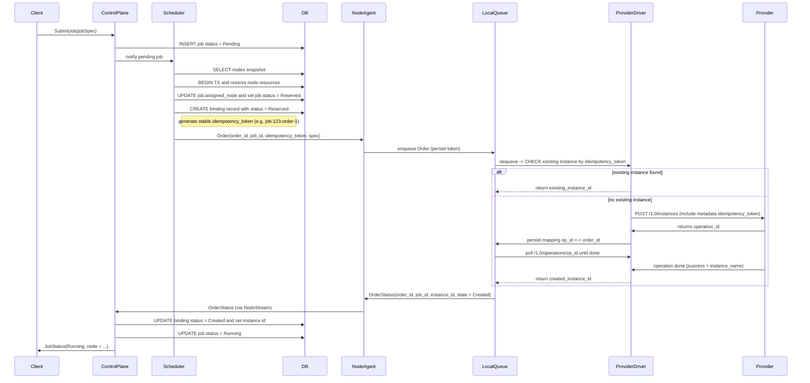

# High-Level Open Scheduler Workflow

```mermaid
sequenceDiagram
  participant Client
  participant ControlPlane
  participant Scheduler
  participant DB
  participant NodeAgent
  participant LocalQueue
  participant ProviderDriver
  participant Provider

  Client->>ControlPlane: SubmitJob(jobSpec)
  ControlPlane->>DB: INSERT job status = Pending
  ControlPlane->>Scheduler: notify pending job
  Scheduler->>DB: SELECT nodes snapshot
  Scheduler->>DB: BEGIN TX and reserve node resources
  Scheduler->>DB: UPDATE job.assigned_node and set job.status = Reserved
  Scheduler->>DB: CREATE binding record with status = Reserved
  Note right of Scheduler: generate stable idempotency_token (e.g. job-123-order-1)
  Scheduler->>NodeAgent: Order(order_id, job_id, idempotency_token, spec)
  NodeAgent->>LocalQueue: enqueue Order (persist token)
  LocalQueue->>ProviderDriver: dequeue -> CHECK existing instance by idempotency_token
  alt existing instance found
    ProviderDriver-->>LocalQueue: return existing_instance_id
  else no existing instance
    ProviderDriver->>Provider: POST /1.0/instances (include metadata idempotency_token)
    Provider->>ProviderDriver: returns operation_id
    ProviderDriver->>LocalQueue: persist mapping op_id <-> order_id
    LocalQueue->>ProviderDriver: poll /1.0/operations/op_id until done
    Provider->>ProviderDriver: operation done (success + instance_name)
    ProviderDriver-->>LocalQueue: return created_instance_id
  end
  LocalQueue->>NodeAgent: OrderStatus(order_id, job_id, instance_id, state = Created)
  NodeAgent->>ControlPlane: OrderStatus (via NodeStream)
  ControlPlane->>DB: UPDATE binding status = Created and set instance id
  ControlPlane->>DB: UPDATE job.status = Running
  ControlPlane->>Client: JobStatus(Running, node = ...)
```